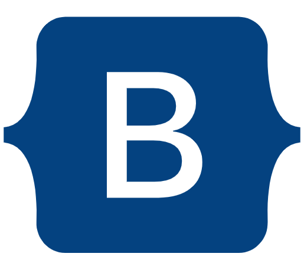
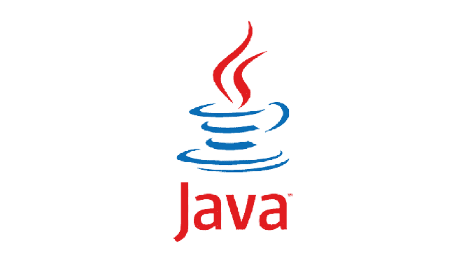
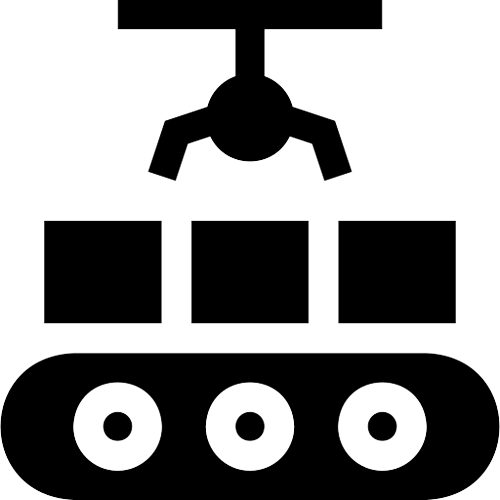
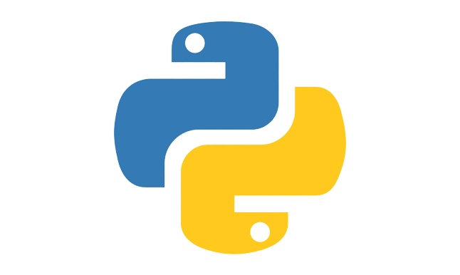
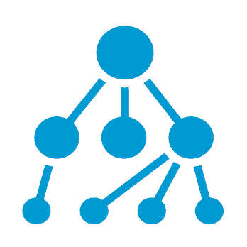
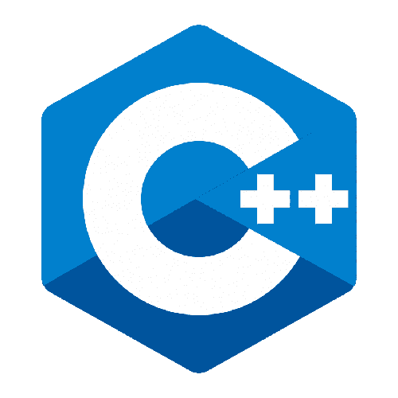
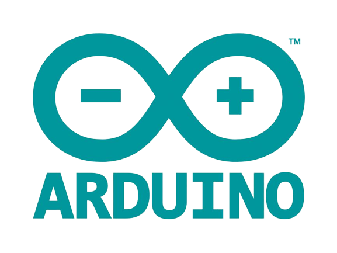

#  Hi, I am Zakaria WildAli 👨‍💻

## I am a Front-End Developer </>.

- 👀 I’m passionate about technology
- 🌱 I’m currently learning everything 🤣
- 👯 I’m looking for a job
- 🥅 2023 Goals: Achieve a good job in a company
- ⚡ Fun fact: I love volleyball and computer games

### 🔭 Have a look at my [website](https://zakaria-ali.github.io/react-portfolio/).

---

### ⚡ Languages and Tools:
Here are a few things I've picked up along my learning journey.

---

## 📫 Get in touch

&nbsp;&nbsp;

&nbsp;&nbsp;

&nbsp;&nbsp;

or give some ♥ on [mail](mailto:zakaria.wildali.7@gmail.com).

